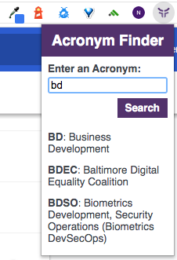
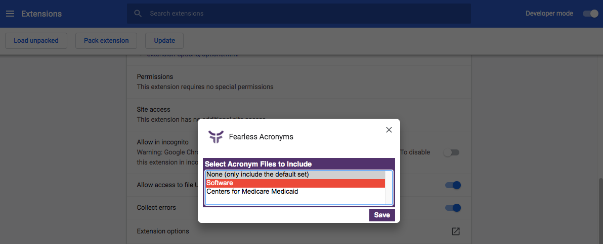

# Fearless Acronym Extension

This extension adds an icon to the browser bar that, when clicked, displays a search dropdown. When users perform a search, full and partial matches are returned. Users select which acronym files are relevant to them via the extension options.



## Setup

1. Clone or [download](https://github.com/FearlessSolutions/acronym_plugin/archive/master.zip) the acronym project

`git clone https://github.com/FearlessSolutions/acronym_plugin.git`

2. In Chrome, navigate to the Extentions page (Window > Extensions).

3. Verify that "Developer mode" is enabled.

4. In the upper left, click the "Load unpacked" button.

5. Select the directory with the acronym project. This will load the extension into your browser

## Extension Options

1. To select which acronyms are used in the extension, navigate to the Extentions page (Window > Extensions)

2. Click on "Extension options" and a pop-up will display

3. Select the appropriate acronym sets for your use case



## Using the extension

1. Click on the Fearless logo in the browser extension toolbar, a dropdown with an input box should display.

2. Enter the acronym into the input box, the results will return full and partial matches.

## Adding new acronym sets

Before adding new files, try to remove duplicates between the new project specific file and the baseline files (fearless.json and software.json).

1. Add the JSON file to the `acronyms` project directory. Be sure to format it with consideration to the following information.

   _Note that when there are multiple meanings for the same acronym, a new entry should be created_

   `abbreviation` Acronym

   `title` An individual meaning of the acronym

   `description` (optional) in future functionality, it would be nice to have additional or contextual information to include

   `category` (optional) in future functionality, it could be helpful to have more granular classification of the terms

Example:

```
{
    "abbreviation": "TLA",
    "title": "Three Letter Acronym",
    "description": "This is a longer description of the TLA"
    "category": "Base"
}
```

2. Update `base.js` by adding an entry referencing the new file

   `ref` id used in the html of the Extension Options setting

   `name` display name used to reference the acronym set in the Extension Options setting

   `default` whether to always include the acroynym set in searches. This should more than likely be set to false.

   `url` absolute URL for the JSON file

Example:

```
{
    ref: "new-file",
    name: "Display name",
    default: false,
    url:
      "https://URL_TO_FILE/FILENAME.json",
}
```

3. Verify!

   - File name displays in the list of Extension Options
   - File can be selected and saved in the Extension Options
   - Acronyms return in the search results when the file _is_ selected in the Extension Options
   - Acronyms _do not_ return when the file _is not_ selected in the Extension Options
